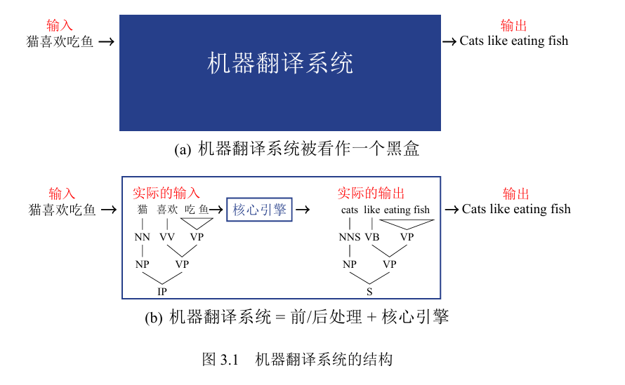
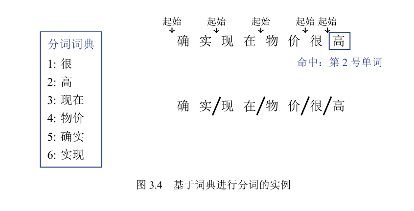
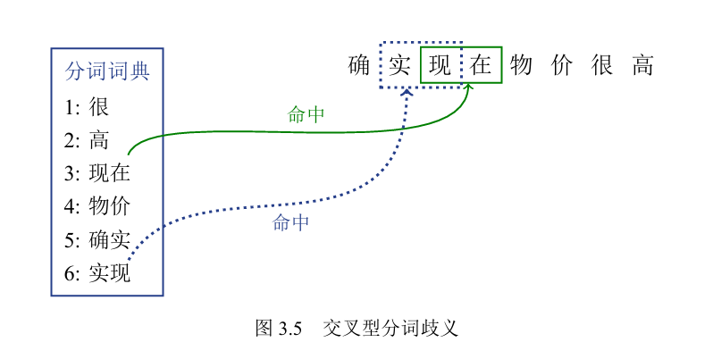
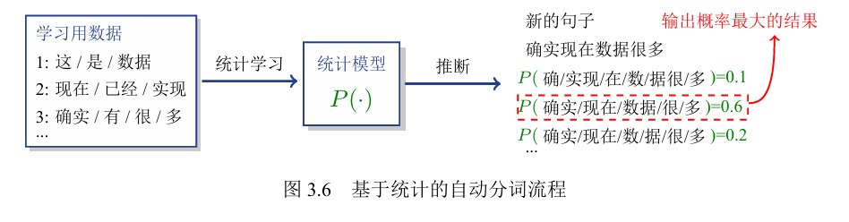
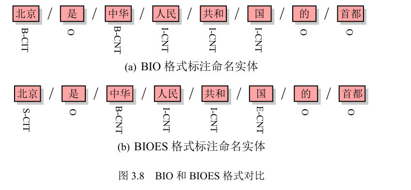
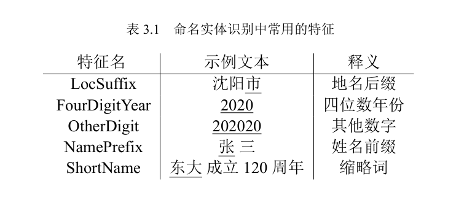
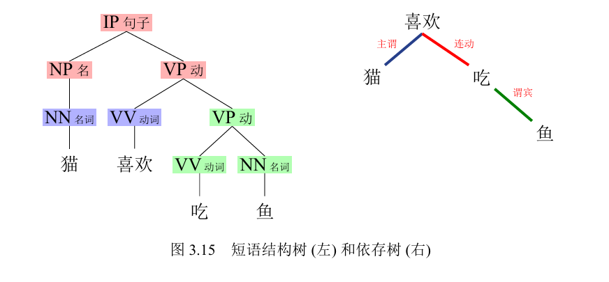
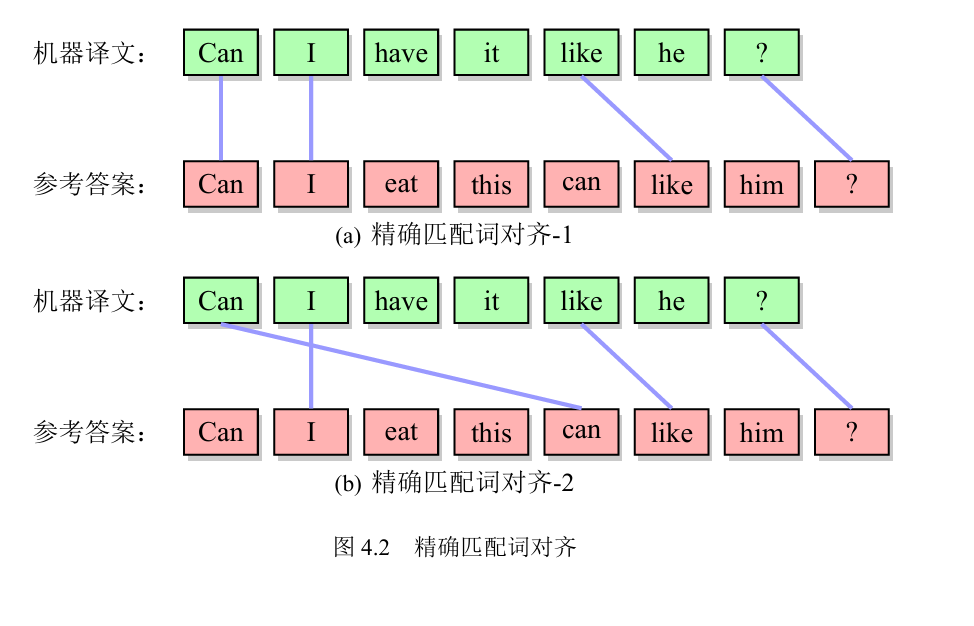
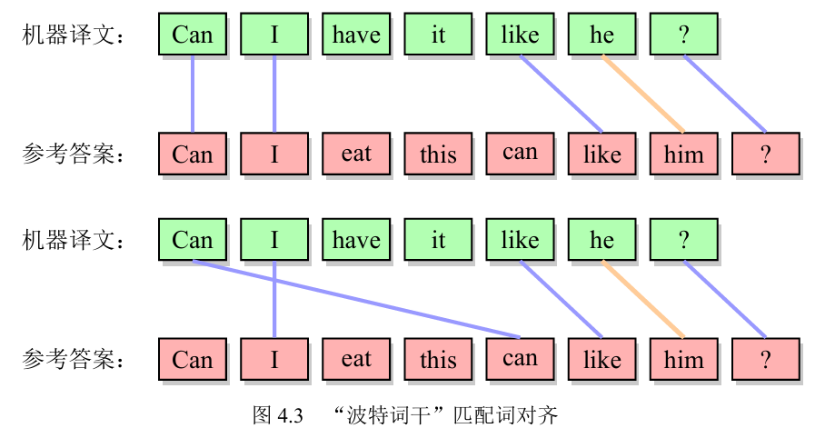
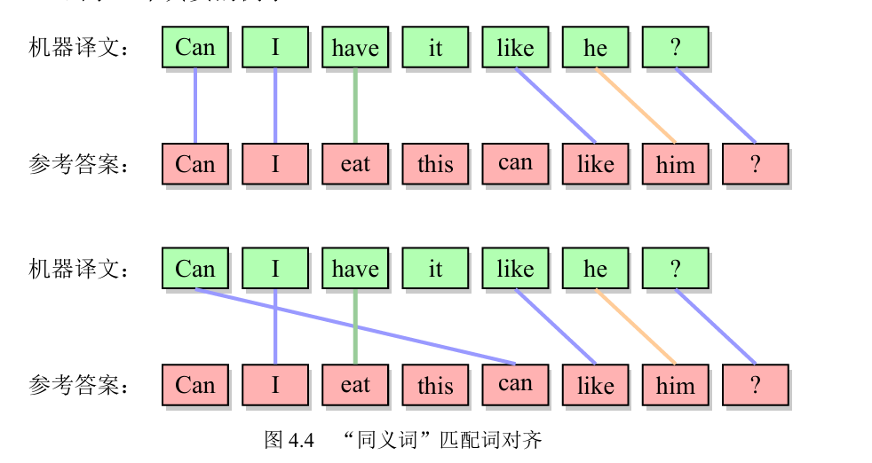

# 机器翻译

## 统计语言建模基础

### KL 距离和熵

以球队夺冠概率来举例子，假设几只队伍的实力未知或者实力相当，那么人们就**很难对比赛结果做出预测。信息熵也相对较高**；如果这几只球队中某一支球队的实力可以碾压其他球队，那么人们对比赛结果的预测就会很明确。**结果是容易猜到的**，**信息量和信息熵也就相对较低**。因此可以得知：分布越尖锐熵越低，分布越均匀熵越高。

如果同一个随机变量X上有两个概率分布P(x)和Q(x)，那么可以使用KullbackLeibler 距离或 KL 距离（KL Distance）来衡量这两个分布的不同（也称作KL散度）。这种度量就是相对熵（Relative Entropy）它衡量的是同一个事件空间里两个概率分布的差异

交叉熵（Cross entropy）是一个与KL距离密切相关的概念，从实践的角度来说，交叉熵与KL距离的目的相同：都是用来描述两个分布的差异。由于交叉熵计算上更加直观方便，因此在机器翻译中被广泛应用。

### n-gram 语言模型

n-gram语言模型。它是一种经典的统计语言模型，而且在机器翻译及其他自然语言处理任务中有非常广泛的应用。其中n-gram表示n个连续单词构成的单元，也被称作n元语法单元。这个模型的数学描述如下：
$$
P(w_m|w_1w_2...w_{m−1}) =P(w_m|w_{m−n+1}...w_{m−1})
$$

#### 参数估计和平滑算法

对于n-gram 语言模型，每个$ P(w_m|w_{m−n+1}...w_{m−1}) $都可以被看作是模型的参数（Parameter）。而 n-gram 语言模型的一个核心任务是估计这些参数的值，即参数估计。通常，参数估计可以通过在数据上的统计得到。一种简单的方法是：给定一定数量的句子，统计每个n-gram出现的频次，并利用上述公式得到每个参数$ P(w_m|w_{m−n+1}...w_{m−1}) $的值。这个过程也被称作模型的训练（Training）

但是参数估计方法并不完美，因为它无法很好地处理低频或者未见现象。比如，如果语料中从没有“确实”和“现在”两个词连续出现的情况，即c(确实/现在)=0。
$$
P(现在|确实) =\frac{c(确实/现在)}{c(确实)} 
=\frac{0}{c(确实)} = 0
$$
显然，这个结果是不合理的。因为即使语料中没有“确实”和“现在”两个词连续出现，这种搭配也是客观存在的。

更常见的问题是那些根本没有出现在词表中的词，称为**未登录词**（Out of vocabulary Word，OOV Word），比如一些生僻词，可能模型训练阶段从来没有看到过，这时模型仍然会给出0概率。

为了解决未登录词引起的零概率问题，常用的做法是对模型进行**平滑（Smoothing）**，也就是给可能出现零概率的情况一个非零的概率，使得模型不会对整个序列给出零概率。

语言模型使用的平滑算法有很多。例如：**加法平滑法**、**古德图灵估计法**和**Kneser-Ney平滑**。这些方法也可以被应用到其他任务的概率平滑操作中。

**加法平滑（Additive Smoothing）**是一种简单的平滑技术。通常情况下，系统研发者会利用采集到的语料库来模拟真实的全部语料库。当然，没有一个语料库能覆盖所有的语言现象。加法平滑方法假设每个n-gram出现的次数比实际统计次数多θ次，0<θ≤1。这样，计算概率的时候分子部分不会为0。重新计算P(现在|确实)，可以得到：
$$
P(现在|确实) =\frac{θ+c(确实/现在)}{\sum^{|V|}_{w}(θ+c(确实/w))} 
=\frac{ θ+c(确实/现在)}{θ|V |+c(确实)}
$$
其中，V 表示词表，|V|为词表中单词的个数，w为词表中的一个词，c表示统计单词或短语出现的次数。有时候，加法平滑方法会将θ取1，这时称之为**加一平滑或是拉普拉斯平滑**。这种方法比较容易理解，也比较简单，因此常被用于对系统的快速实现上。

**古德-图灵估计（Good-Turing Estimate）**也是很多平滑算法的核心，其基本思路是：把非零的n元语法单元的概率降低，匀给一些低概率n元语法单元，以减小最大似然估计与真实概率之间的偏离

`Kneser-Ney `平滑方法是被广泛认为是最有效的平滑方法之一

#### 语言模型的评测

困惑度（Perplexity，PPL）是一种衡量语言模型的好坏的指标。对于一个真实的词序列$w_1...w_m$，困惑度被定义为：
$$
PPL = P(w_1...w_m)−1
$$
本质上，PPL反映了语言模型对序列可能性预测能力的一种评估。如果$w_1...w_m$是真实的自然语言，“完美”的模型会得到$PPL = P(w_1...w_m)−1$，它对应了最低的困惑度PPL=1，这说明模型可以完美地对词序列出现的可能性进行预测。当然，真实的语言模型是无法达到PPL=1的

### 预测与搜索

给定模型结构，统计语言模型的使用可以分为两个阶段：

- 训练（Training）：从训练数据上估计出语言模型的参数。
- 预测（Prediction）：用训练好的语言模型对新输入的句子进行概率评估，或者生成新的句子。

实际上，生成最优词序列的问题也是自然语言处理中的一大类问题—序列生成（Sequence Generation）。机器翻译就是一个非常典型的序列生成任务，**序列生成任务的本质并非让语言模型凭空“生成”序列，而是使用语言模型在所有候选的单词序列中“找出”最佳序列。**这个过程对应着经典的**搜索问题**（Search Problem）

#### 搜索问题的建模

在序列生成任务中，基于语言模型的搜索问题可以被描述为：
$$
\hat{w}=argmax_{w∈χ}P(w)
$$
这里arg即argument（参数），$argmax_xf(x)$表示返回使f(x)达到最大的x。$argmax_{w∈χ}P(w) $表示找到使语言模型得分P(w)达到最大的单词序列w。χ是搜索问题的解空间，它是所有可能的单词序列w的集合。ˆ w可以被看做该搜索问题中的“最优解”，即概率最大的单词序列。

为了方便计算机实现，通常定义单词序列从一个特殊的符号<sos>后开始生成。同样地，一个单词序列的结束也用一个特殊的符号<eos>来表示,在这种序列生成策略的基础上，实现搜索通常有两种方法——**深度优先遍历**和
**宽度优先遍历**

#### 经典搜索

##### 无信息搜索

在**深度优先搜索**中，每次总是先挑选一个单词，等枚举完当前单词全部子节点构成的序列后，才会选择下一个兄弟节点继续进行搜索。

**宽度优先搜索**的过程：它维护了一个未结束单词序列的集合，每次扩展单词序列后根据长度往集合里面加入单词序列。而搜索问题关心的是单词序列的得分而非其长度。因此可以在搜索过程中维护未结束的单词序列集合里每个单词序列的得分，然后优先扩展该集合中得分最高的单词序列，使得扩展过程中未结束的单词序列集合包含的单词序列分数逐渐变高。

上面描述的两个改进后的搜索方法属于**无信息搜索**（Uninformed Search）

##### 启发性搜索

在搜索问题中，一个单词序列的生成可以分为两部分：已生成部分和未生成部分。既然最终目标是使得一个完整的单词序列得分最高，那么关注未生成部分的得分也许能为搜索策略的改进提供思路。

利用语言模型的其他特性也可以实现对未生成部分得分的估计。这个对未生成部分得分的估计通常被称为**启发式函数（Heuristic Function）**

#### 局部搜索

由于全局搜索策略要遍历整个解空间，所以它的时间、空间复杂度一般都比较高。局部搜索是非经典搜索里的一个重要方面，局部搜索策略不必遍历完整的解空间，因此降低了时间、空间复杂度，但是这也导致可能
会丢失最优解甚至找不到解，所以局部搜索都是不完备的而且非最优的。但是，在自然语言处理中，很多问题由于搜索空间过大无法使用全局搜索，因此使用局部搜索是非常普遍的。

##### 贪婪搜索

当一个问题可以拆分为多个子问题时，如果一直选择子问题的最优解就能得到原问题的最优解，那么就可以不必遍历原始的解空间，而是使用这种“贪婪”的策略进行搜索。贪婪搜索在搜索到一个完整的序列，也就是搜索到即停止，而改进的深度优先搜索会遍历整个解空间。因此贪婪搜索非常高效，其时间和空间复杂度仅为
O(m)，这里m为单词序列的长度。由于贪婪搜索并没有遍历整个解空间，所以该方法不保证一定能找到最优解。

##### 束搜索

贪婪搜索会产生质量比较差的解是由于当前单词的错误选择造成的。既然每次只挑选一个单词可能会产生错误，那么可以通过同时考虑更多候选单词来缓解这个问题，也就是对于一个位置，可以同时将其扩展到若干个节点。这样就扩大了搜索的范围，进而使得优质解被找到的概率增大。

常见的做法是每一次生成新单词的时候都挑选得分最高的前B个单词，然后扩展这B个单词的T个孩子节点，得到BT条新路径，最后保留其中得分最高的B条路径。从另外一个角度理解，它相当于比贪婪搜索看到了更多的路径，因而它更有可能找到好的解。这个方法通常被称为**束搜索（Beam Search）**。

## 词法分析和语法分析基础

**分词（Word Segmentation）**：这个过程会把词串进行切分，切割成最小的具有完整功能的单元—单词（Word）。

**句法分析（Parsing）：**这个过程会对分词的结果进行进一步分析。比如，可以对句子进行浅层分析，得到句子中实体的信息（如人名、地名等）。也可以对句子进行更深层次的分析，得到完整的句法结构，这种结构可以被看作是对句子的进一步抽象，被称为短语结构树，比如，NP+VP就可以表示由名词短语（Noun Phrase，NP）和动词短语（Verb Phrase，VP）构成的主谓结构。

一般来说，在送入机器翻译系统前需要对文字序列进行处理和加工，这个过程被称为**预处理（Pre processing）**。类似地，在机器翻译模型输出译文后进行的处理被称作**后处理（Post processing）**。

机器翻译所使用的“单词”和“结构”本身并不是为了符合人类的解释，它们更直接目的是为了进行翻译。从系统开发的角度，有时候即使使用一些与人类的语言习惯有差别的处理，仍然会带来性能的提升，比如在神经机器翻译中，在传统分词的基础上进一步使用双字节编码（Byte Pair Encoding，BPE）子词切分 会使得机器翻译性能大幅提高。

### 中文分词

对于机器翻译系统而言，输入的是已经切分好的单词序列，而不是原始的字符串。比如，对于一个中文句子，单词之间是没有间隔的，因此需要把一个个的单词切分出来，这样机器翻译系统可以区分不同的翻译单元。

广义上，可以把上述过程看作是一种分词过程，即：将一个输入的自然语言字符串切割成单元序列，每个单元（Token）都对应可以处理的最小单位。

#### 基于词典的分词方法

在使用基于词典的分词方法时，只需预先加载词典到计算机中，扫描输入句子，查询其中的每个词串是否出现在词典中。如图3.4所示，有一个包含六个词的词典，给定输入句子“确实现在物价很高”后，分词系统自左至右遍历输入句子的每个字，发现词串“确实”在词典中出现，说明“确实”是一个“词”。之后，重复这个过程。

但是，基于词典的分词方法很“硬”,这是因为自然语言非常灵活，经常出现歧义，从词典中查看，“实现”和“现在”都是合法的单词，但是在句子中二者有重叠，因此词典无法告诉系统哪个结果是正确的。

基于词典的分词方法是典型的基于规则的方法，完全依赖于人工给定的词典。在遇到歧义时，需要人工定义消除歧义的规则，比如，可以自左向右扫描每次匹配最长的单词，这是一种简单的**启发式消歧策略**。但是启发式消歧策略仍然需要人工定义

#### 基于统计的分词方法

统计分词也是一种典型的数据驱动方法。这种方法将已经经过分词的数据“喂”给系统，这个数据也被称作标注数据（Annotated Data）。

在获得标注数据后，**系统自动学习一个统计模型来描述分词的过程**，而这个模型会把分词的“知识”作为参数
保存在模型中。当送入一个新的需要分词的句子时，可以利用学习到的模型对可能的分词结果进行概率化的描述，最终选择概率最大的结果作为输出。这个方法就是基于统计的分词方法

以“确实现在数据很多”这个实例来说，如果把这句话按照“确实/现在/数据/很/多”这样的方式进行切分，这个句子切分的概率P(确实/现在/数据/很/多)可以通过每个词出现概率相乘的方式进行计算。
$$
P(确实/现在/数据/很/多)
= P(确实)·P(现在)·P(数据)·P(很)·P(多)
$$
经过充分训练的统计模型P(·)就是我们介绍的分词模型。对于输入的新句子S，通过这个模型找到最佳的分词结果输出。假设输入句子S是“确实现在数据很多”，可以通过列举获得不同切分方式的概率，其中概率最高的切分方式，就是系统的目标输出。这种分词方法也被称作基于**1-gram语言模型的分词**，或**全概率分词**

### 命名实体识别

在翻译技术文献时，往往需要对术语进行识别并进行准确翻译，因此引入**命名实体识别（Named Entity Recognition）**可以帮助系统对特定术语进行更加细致的处理。

#### 序列标注任务

命名实体识别是一种典型的序列标注（Sequence Labeling）任务，对于一个输入序列，它会生成一个相同长度的输出序列。**输入序列的每一个位置，都有一个与之对应的输出，输出的内容是这个位置所对应的标签**（或者类别）。

通常来说，序列标注任务中首先需要定义标注策略，即使用什么样的格式来对序列进行标注。

- BIO 格式（Beginning inside outside）。以命名实体识别为例，B代表一个命名实体的开始，I表示一个命名实体的其它部分，O表示一个非命名实体单元。
- BIOES 格式。与BIO格式相比，多出了标签E（End）和S（Single）仍然以命名实体识别为例，E和S分别用于标注一个命名实体的结束位置和仅含一个单词的命名实体。

图中的“B”、“I”、“E”等标注出了位置信息，而“CIT”和“CNT”则标注出了命名实体类别（“CIT”表示城市，“CNT”表示国家）。

#### 基于特征的统计学习

基于特征的统计学习是解决序列标注的有效方法之一。命名实体识别任务中的每个词的词根、词性和上下文组合也可以被看做是识别出命名实体可以采用的特征。

特征的形式可以分为**连续型特征**和**离散型特征**，前者通常用于表示取值蕴含数值大小关系的信息，如人的身高和体重，后者通常用于表示取值不蕴含数值大小关系的信息，如人的性别。

系统开发者可以通过定义多样的特征来从多个不同的角度对目标问题进行建模。而这种设计特征的过程也被称作特征工程（Feature Engineering）。

对于命名实体识别任务来说。输入的每个单词，可以将其表示为一个单词和对应的**词特征（Word Feature）**的组合，记作$<w,f>$。通过这样的表示，就可以将原始的单词序列转换为词特征序列。

#### 基于概率图模型的方法

**概率图模型（Probabilistic Graphical Model**）是使用图表示**变量及变量间概率依赖关系**的方法。在概率图模型中，可以根据可观测变量推测出未知变量的条件概率分布等信息。

#### 基于分类器的方法

### 句法分析

#### 句法树

句法（Syntax）是研究句子的每个组成部分和它们之间的组合方式。自然语言处理领域最常用的两种句法分析形式是**短语结构句法分析（Phrase Structure Parsing）**和**依存句法分析（Dependency Parsing）**。

短语结构树中，每个词都有词性(或词类)，不同的词或者短语可以组成名动结构、动宾结构等语言学短语结构，短语结构句法分析一般也被称为成分句法分析（Constituency Parsing）或完全句法分析（Full Parsing）。

依存句法树表示了句子中单词和单词之间的依存关系。比如，从这个例子可以了解，“猫”依赖“喜欢”，“吃”依赖“喜欢”，“鱼”依赖“吃”。

短语结构树和依存句法树的结构和功能有很大不同。短语结构树的叶子节点是单词，中间节点是词性或者短语句法标记。在短语结构句法分析中，通常把单词称作终结符（Terminal），把词性称为预终结符（Pre terminal），而把其他句法标记称为非终结符（Nonterminal）。

依存句法树没有预终结符和非终结符，所有的节点都是句子里的单词

#### 上下文无关文法

形式文法是分析自然语言的一种重要工具。根据乔姆斯基的定义，形式文法分为四种类型：**无限制文法（0型文法）、上下文有关文法（1型文法）、上下文无关文法（2型文法）和正规文法（3型文法）**。不同类型的文法有不同的应用，比如，正规文法可以用来描述有限状态自动机，因此也会被使用在语言模型等系统中。对于短语结构句法分析问题，常用的是上下文无关文法（Context free Grammar）

上下文无关文法的规则是一种产生式规则（Production Rule），形如α→β，它表示把规则左端的非终结符α替换为规则右端的符号序列β。通常，α被称作规则的左部（Left hand Side），β 被称作规则的右部（Right hand Side）。使用右部β 替换左

## 翻译质量评价

### 有参考答案的自动评价

人工评价费事费力，同时具有一定的主观性，甚至不同人在不同时刻面对同一篇文章的理解都会不同。如果将人类专家翻译的结果看作是参考答案，**将译文与答案的近似程度作为评价结果**。即译文与答案越接近，评价结果越好；反之，评价结果较差。这种评价方式叫做**自动评价（Automatic Evaluation）**。自动评价具有速度快，成本低、一致性高的优点，因此自动评价是也是机器翻译系统研发人员所青睐的方法。

#### 基于词串比对的方法

其思想是将译文看成是符号序列，通过计算**参考答案和机器译文间的序列相似性**来评价机器翻译的质量。

##### 基于距离的方法

基于距离的自动评价方法的基本思想是：将机器译文转化为参考答案所需要的最小编辑步骤数作为译文质量的度量，基于此类思想的自动评价方法主要有**单词错误率（Word Error Rate，WER）**、与**位置无关的单词错误率（Position independent word Error Rate，PER）** 和**翻译错误率（Translation Error Rate，TER）**

TER 是一种典型的基于距离的评价方法，通过评定机器译文的译后编辑工作量来衡量机器译文质量。在这里“距离”被定义为将一个序列转换成另一个序列所需要的最少编辑操作次数，操作次数越多，距离越大，序列之间的相似性越低；相反距离越小，表示一个句子越容易改写成另一个句子，序列之间的相似性越高。
$$
score =\frac{edit(o,g)}{l} 
$$
其中，edit(o,g) 表示系统生成的译文o和参考答案g之间的距离，l是归一化因子,通常为参考答案的长度。

例如：机器译文：A cat is standing in the ground .
			参考答案：The cat is standing on the ground .

在这个示例中一共替换了两次a->the,in->on，所以edit(o,g)=2，所以该机器译文的TER结果为2/8。

##### 基于 n-gram 的方法

`BLEU` (Bilingual Evaluation Understudy)是目前使用最广泛的自动评价指标。通过采用n-gram匹配的方式
评定机器翻译结果和参考答案之间的相似度，机器译文越接近参考答案就认定它的质量越高。`BLEU` 的计算首先考虑待评价机器译文中n-gram在参考答案中的匹配率，称**n-gram 准确率（n-gram Precision）**
$$
P_n = \frac{count_{hit}}{count_{output}}
$$
$count_{hit}$表示机器译文中n-gram在参考答案中命中的次数，$count_{output}$ 表示机器译文中总共有多少n-gram

为了避免同一个词被重复计算，`BLEU`的定义中使用了截断的方式定义$count_{hit}$和$count_{output}$ 。

令N表示最大n-gram的大小，则译文整体的准确率等于各n-gram的加权平均：
$$
P_{avg} = exp(\sum^{N}_{n=1}w_n·logP_n)
$$
该方法更倾向于对短句子打出更高的分数。一个极端的例子是译文只有很少的几个词，但是都命中答案，准确率很高可显然不是好的译文。因此，`BLEU`引入短句惩罚因子（Brevity Penalty，BP）的概念，对短句进行惩罚:
$$
BP = \begin{cases}
1 &\  c>r\\
exp(1− \frac{r}{c})&\ c≤r

\end{cases}
$$
c表示机器译文的句子长度，r表示参考答案的句子长度。最终`BLEU`的计算公式为：
$$
BLEU = BP·exp(\sum^{N}_{N=1}w_n·logP_n)
$$
实际上，`BLEU`的计算也是一种综合考虑**准确率（Precision）**和**召回率（Recall）**的方法。BP是一种召回率的度量，它会惩罚过短的结果；$exp(\sum^{N}_{N=1}w_n·logP_n)$是一种准确率的表示

准确率（Precision）和召回率（Recall）是评估分类模型性能的两个重要指标，它们通常用于信息检索和机器学习领域。

**准确率（Precision）**：在所有被模型预测为正类（positive class）的样本中，实际为正类的比例。

**召回率（Recall）**：在所有实际为正类的样本中，被模型正确预测为正类的比例。

虽然`BLEU`被广泛使用，但也并不完美，甚至经常被人诟病。比如，它需要依赖参考答案，而且评价结果有时与人工评价不一致，同时`BLEU`评价只是单纯地从词串匹配的角度思考翻译质量的好坏，并没有真正考虑句子的语义是否翻译正确。但是，毫无疑问，`BLEU`仍然是机器翻译中最常用的评价方法。在没有找到更好的替代方案之前，`BLEU`还是机器翻译研究中最重要的评价指标之一。

#### 基于词对齐的方法

基于词对齐的方法，顾名思义就是根据参考答案中的单词与译文中的单词之间的对齐关系对机器翻译译文进行评价。

在基于词对齐的自动评价方法中，一种典型的方法是Meteor。该方法通过计算精确的单词到单词（Word to Word）的匹配来度量一个译文的质量，并且在精确匹配之外，还引入了“波特词干”匹配和“同义词”匹配。

在机器译文与参考答案之间建立单词之间的对应关系。单词之间的对应关系在建立过程中主要涉及三个模型，在对齐过程中依次使用这三个模型进行匹配：

首先是精确模型:精确模型在建立单词对应关系时，要求机器译文端的单词与参考答案端的单词完全一致，并且在参考答案端至多有1个单词与机器译文端的单词对应，否则会将其视为多种对应情况。

然后是波特词干模型，该模型在精确匹配结果的基础上，对尚未对齐的单词进行基于词干的匹配，只需机器译文端单词与参考答案端单词的词干相同即可，如上文中的“he”和“him”

最后是同义词模型该模型在前两个模型匹配结果的基础上，对尚未对齐的单词进行同义词的匹配，即基于Word Net词典匹配机器译文与参考答案中的同义词。如图中的“eat”和“have”

由于召回率反映参考答案在何种程度上覆盖目标译文的全部内容，而Meteor在评价过程中显式引入召回率，所以Meteor的评价与人工评价更为接近。但Meteor方法需要借助同义词表、功能词表等外部数据，当外部数据中的目标词对应不正确或缺失相应的目标词时，评价水准就会降低。特别是，针对汉语等与英语差异较大的
语言，使用Meteor方法也会面临很多挑战。不仅如此，超参数的设置和使用，对于评分也有较大影响。

#### 基于检测点的方法

上述提到的方法可以对译文的整体质量进行评估，但是缺乏对具体问题的细致评价。基于检测点的方法可以让研究人员需要知道系统是否能够处理特定类型的翻译问题，而不是得到一个笼统的评价结果。

基于检测点的评价根据事先定义好的语言学检测点对译文的相应部分进行打分。如下是几个英中翻译中的检测点实例：

- They got up at six this morning .
  他们/今天/早晨/六点钟/起床/。
  检测点：时间词的顺序

- There are nine cows on the farm .

  农场/里/有/九/头/牛/。
  检测点：量词“头”

- His house is on the south bank of the river .
  他/的/房子/在/河/的/南岸/。
  We keep our money in a bank .
  我们/在/一家/银行/存钱/。
  检测点：bank的多义翻译

基于检测点的评价方法的意义在于，它并不是简单给出一个分数，反而更像是一种诊断型评估方法，能够帮助系统研发人员定位系统问题。因此这类方法更多地使用在对机器翻译系统的翻译能力进行分析上，是对BLEU等整体评价指标的一种很好的补充。

#### 多策略融合的评价方法

基于策略融合的自动评价方法往往会将多个基于词汇、句法和语义的自动评价方法融合在内，其中比较核心的问题是如何将多个评价方法进行合理地组合。目前提出的方法中颇具代表性的是使用参数化方式和非参数化方式对多种自动评价方法进行筛选和组合。

参数化组合方法的实现主要有两种方式：

- 一种方式是广泛使用不同的译文质量评价作为特征，借助回归算法实现多种评价策略的融合；
- 另一种方式则是对各种译文质量评价方法的结果进行加权求和，并借助机器学习算法更新内部的权重参数，从而实现多种评价策略的融合

#### 译文多样性

由于句子的灵活排序和大量同义词的存在，导致同一个源语言句子可能对应几百个合理的目标语言译文，甚至更多。为了改变这种窘况，比较直观的想法是增大参考答案集或是直接比较机器译文与参考答案在词法、句法和语义等方面的差距。

### 无参考答案的自动评价

## 人工神经网络和神经语言建模

## 机器翻译前沿

### 神经机器翻译模型训练

#### 开放词表

在机器翻译中，大词表可以涵盖更多的信息，但是训练代价很高，但是，测试数据中的一些单词根本就没有在训练数据中出现过，这时会出现**未登录词翻译问题**（即OOV问题），即系统无法对未见单词进行翻译。

理想情况下，机器翻译应该是一个开放词表（Open Vocabulary）的翻译任务。也就是，无论测试数据中包含什么样的词，机器翻译系统都应该能够正常翻译。如果出现未登录词的时候，会将这些单词用符号UNK代替。通常，数据中的数量会直接影响翻译性能，过多的会造成欠翻译、结构混乱等问题。

#### 子词

